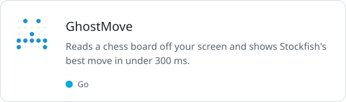
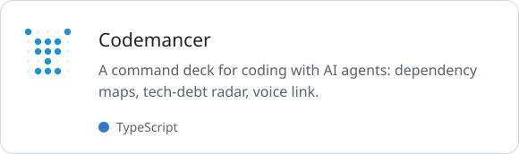
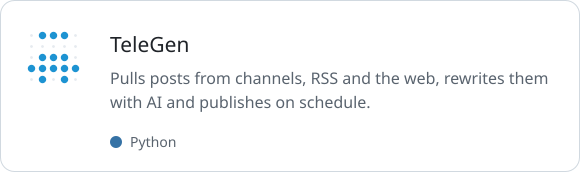
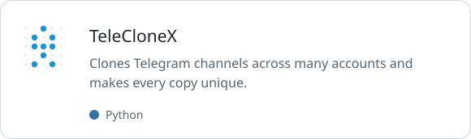
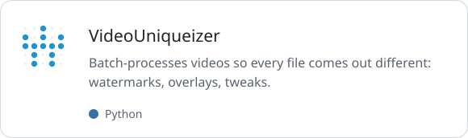
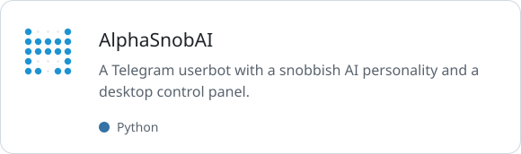

<picture><source media="(prefers-color-scheme: dark)" srcset="assets/banner-dark.svg"></picture>

<picture><source media="(prefers-color-scheme: dark)" srcset="assets/quote-dark.svg"></picture>

 

<a href="https://github.com/atljh/GhostMove"><picture><source media="(prefers-color-scheme: dark)" srcset="assets/card-ghostmove-dark.svg"></picture></a> <a href="https://github.com/atljh/Codemancer"><picture><source media="(prefers-color-scheme: dark)" srcset="assets/card-codemancer-dark.svg"></picture></a>

<a href="https://github.com/atljh/TeleGen"><picture><source media="(prefers-color-scheme: dark)" srcset="assets/card-telegen-dark.svg"></picture></a> <a href="https://github.com/atljh/TeleCloneX"><picture><source media="(prefers-color-scheme: dark)" srcset="assets/card-teleclonex-dark.svg"></picture></a>

<a href="https://github.com/atljh/VideoUniqueizer"><picture><source media="(prefers-color-scheme: dark)" srcset="assets/card-videouniqueizer-dark.svg"></picture></a> <a href="https://github.com/atljh/AlphaSnobAI"><picture><source media="(prefers-color-scheme: dark)" srcset="assets/card-alphasnobai-dark.svg"></picture></a>

 

Now building [GramGPT](https://gramgpt.io).
